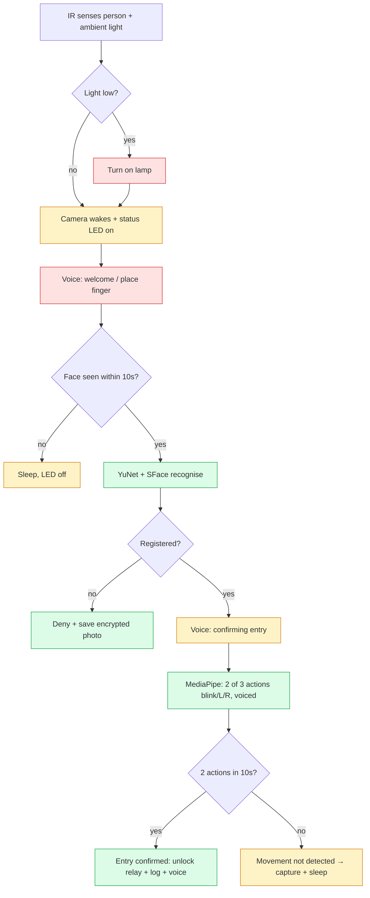
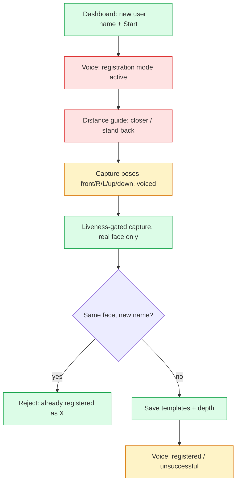

# Biometric Access Control — System Design, Flow & Build Log

Living document. Pairs with `MYTHOS_RUN_2026-06-26.md` (the security audit). Single
spoof-detection method across the whole project: **MediaPipe blink + turn challenge**,
guided by **pre-recorded voice (EN/TA/HI)** so the door needs no screen.

## Runtime access flow

## Register flow

## Gap ledger (plan → status)

| Area | Item | Status |
|------|------|--------|
| Sensing | IR person detect | ✅ motion.py |
| Sensing | Ambient-light read + lamp on | ❌ Phase 3 |
| Sensing | Status LED on=awake/off=sleep | ❌ Phase 3 |
| Voice | Welcome on wake | ❌ Phase 4 |
| Recognise | YuNet+SFace, debounce, multi-face reject | ✅ |
| Recognise | "confirming entry of NAME" (name spoken) | ⚠️ generic confirm clip (no per-name audio) |
| Liveness | 2-of-3 blink/turn, randomized, voiced | ✅ |
| Liveness | No-action → "movement not detected" + capture | ✅ Phase 2 (denied_spoof clip) |
| Liveness | Video-replay resistance | ❌ needs MiniFASNet/depth (known ceiling) |
| Timers | Camera sleep timer editable on dashboard | ✅ Phase 1 |
| Timers | 10s no-face / 30s register sleep | ⚠️ motion idle-off only; per-state timers Phase 4 |
| Dashboard | Live feed (same Wi-Fi) | ✅ |
| Dashboard | Logs + people list | ✅ |
| Dashboard | Entry graph (30 days) | ✅ Phase 1 |
| Dashboard | 1-month auto retention | ✅ Phase 1 (events + images) |
| Dashboard | Forced first-login password change | ✅ Phase 1 |
| Dashboard | Language switch EN/TA/HI + test audio | ✅ |
| Dashboard | Spoof photo gallery (encrypted) | ✅ |
| Dashboard | Wi-Fi setup | ❌ OS-level (raspi-config/nmcli) — out of app |
| Enroll | Same name → append photos | ✅ |
| Enroll | Same FACE, different name → reject | ✅ Phase 2 |
| Enroll | Distance guidance (closer/back) | ❌ Phase 4 (re-add; ~0.5m, "5m" was a typo) |
| Enroll | Voice-guided headless register | ❌ Phase 4 |
| Security | Default secret / password hardening | ✅ (autogen secret, forced pw, preflight) |
| Security | TLS on the LAN dashboard | ❌ deploy-level |
| Hardware | Real fingerprint sensor (R307/R503) | ⚠️ logic ✅, driver=mock |
| Hardware | Camera/GPIO fail-safe + SIGTERM cleanup | ❌ (audit H1–H6) needs Pi |

Legend: ✅ done & tested · ⚠️ partial · ❌ not yet.

## Phase log (each phase: build → run tests → fix → proceed)

- **Phase 1 — Dashboard/DB** ✅ (suite 49→52): sleep-timer control (DB-backed, read live by the
  device thread), forced first-login password change (HTTP middleware), 1-month retention purge of
  events + images (startup + hourly), entry graph (30-day bars on overview). Mythos: forced-change
  middleware verified end-to-end against the running app; no new faults.
- **Phase 2 — Enrollment integrity** ✅ (suite 52→56): one face cannot be registered under two
  names (`duplicate_identity`, rejects different-named match, allows same-name re-register);
  spoof/no-action now says "movement not detected, try again" (`denied_spoof`, EN/TA/HI) while
  still capturing the photo. Mythos: dedupe helper unit-tested; no new faults.
- **Phase 3 — Hardware indicators** ✅ (suite 56→60): `acs/core/indicators.py` — status LED
  (on=awake/off=sleep) + lamp auto-on when the camera scene is dark (brightness from the frame,
  hysteresis), behind enable-flag + gpio/mock drivers; wired into the device thread (wake/sleep/
  periodic light check/close). Mythos: brightness + hysteresis + LED state unit-tested.
- **Phase 4 — Voice completeness** ✅ (suite 60→64): welcome-on-wake; distance-guidance helper
  (`FaceDetector.distance_hint`); all enrollment + greeting clips (welcome, come_closer,
  stand_back, registration_active, registered_ok/failed, look_*) added in EN/TA/HI. Mythos:
  distance helper tested; clip set verified consistent (21 clips × 3 langs, config↔render match).
  Remaining (needs the Pi): the headless register *controller* that sequences these voice
  prompts during capture (today registration is dashboard-screen-driven).

## Deployment
- **`docs/RASPBERRY_PI_GUIDE.md`** — BOM, BCM pin map, wiring, OS prep, libraries (incl. Pi-5
  `lgpio`), Wi-Fi (NetworkManager), production config, systemd, enrollment, per-subsystem
  diagnostics, common failures, DB/backup. `requirements-pi.txt` updated (lgpio/rpi-lgpio,
  apt picamera2). Pins: PIR GPIO4, relay GPIO17, status LED GPIO23, lamp GPIO24, fingerprint
  UART GPIO14/15 `/dev/serial0`, speaker via USB sound card (Pi 5 has no 3.5 mm jack).

## Known production blockers (cannot be closed without the device)
Video-replay spoof (MiniFASNet/depth) · camera/GPIO fail-safe + SIGTERM relay cleanup · TLS ·
real fingerprint wiring · recording the Tamil/Hindi WAVs.

## How to run / deploy
- Dashboard (dev): `python serve.py` → http://127.0.0.1:8010
- Door pipeline: `python run.py` (add `--web` for the dashboard in-process)
- Voice clips: `python scripts/render_voice.py` (EN via TTS; TA/HI need a Piper voice or hand-recorded WAVs in `voice_assets/<lang>/`)
- Before production: `dev_mode:false`, strong `web.session_secret`, change admin password (the dashboard now forces it), set ALSA audio device, mount data on the SSD.
